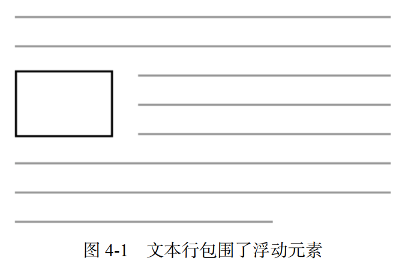
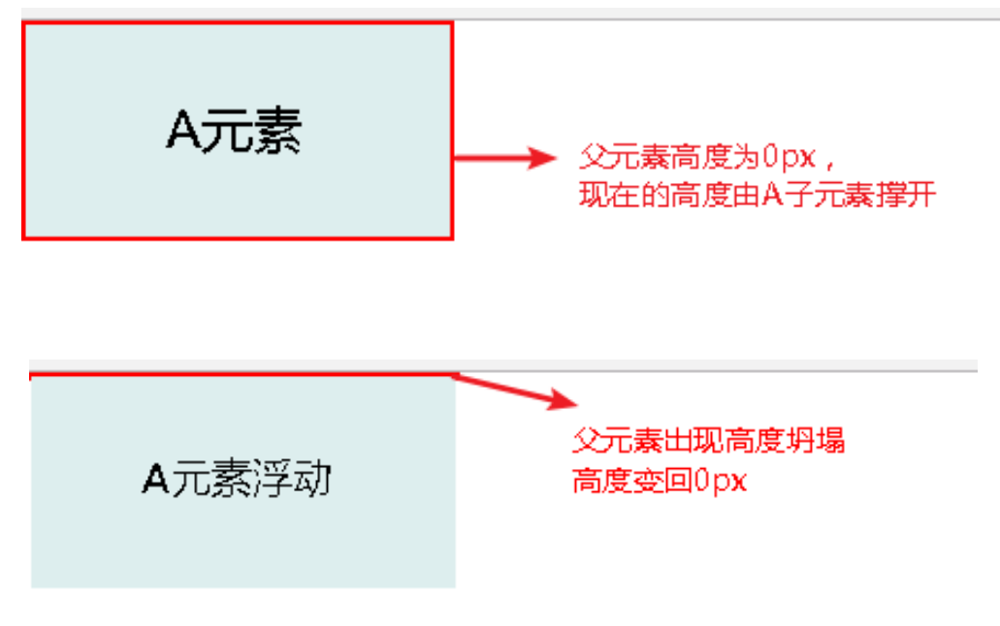

# 浮动

------

## 1.设计初衷：

浮动能将一个元素（通常是一张图片）拉到其容器的一侧，这样文档流就能够包围它（如图 4-1 所示）。这种布局在报纸和杂志中很常见， 因此 CSS 增加了浮动来实现这种效果  

#### 注意：**1、浮动元素会被移出正常文档流，并且变成块级元素（或者说是inline-block元素）  2、父元素本身会高度塌陷，如下图所示 3、影响其他元素排版**

#### 措施：

**1.清除外部影响：**对外部元素使用clear: left || right || both;属性，可以将外部元素（移动到浮动元素的下方（在清除某一侧浮动后）。

这个方法适用于浮动和非浮动元素（不适合行内元素）。

通过设置外部元素为inline-block，已有异曲同工之效。

**2.解决父元素高度塌陷问题：**

​	问题会发生在对父元素没有设定高度，那么父元素默认会按照内部子元素的高度来自动设置高度，而因为float元素脱离了文档流，所以父元素发生高度塌陷。

​	**2.1对最后一个元素设置clear : both**，或者通过伪类

::after{content : '';clear : both;  display : block;}在最后添加一个空内容的元素，并设置clear : both. 

​	**2.2对父元素设置overflow : hidden（本质原理是BFC）**

相关链接：

《深入解析CSS》

[Blog : CSS之浮动布局（float，浮动原理，清除/闭合浮动方法）](https://blog.csdn.net/qq_47443027/article/details/116023924)

[MDN : BFC **块格式化上下文**](https://developer.mozilla.org/zh-CN/docs/Web/Guide/CSS/Block_formatting_context)

[我自己写的方便尝试各种float操作的在线例子](https://codepen.io/mutuyihao/pen/KKZxrxW)
